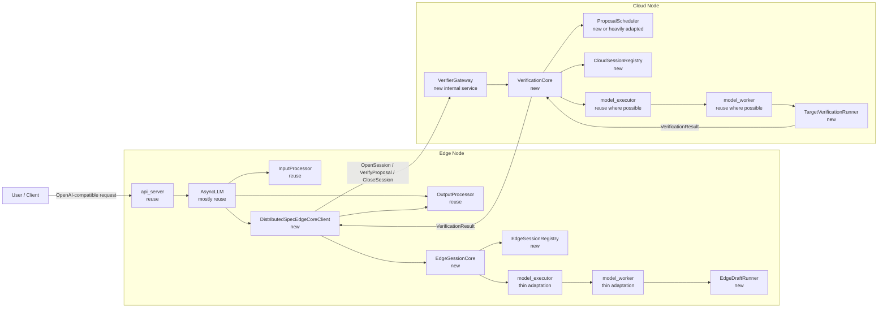
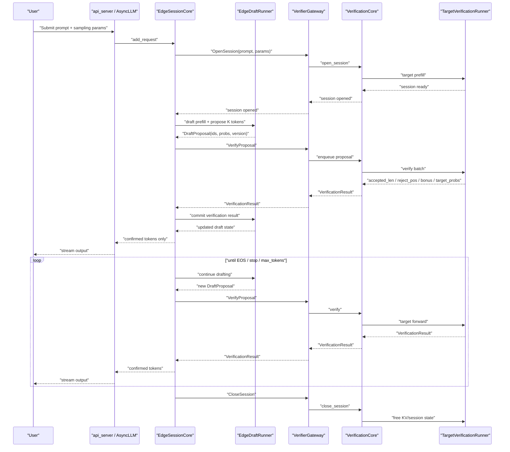
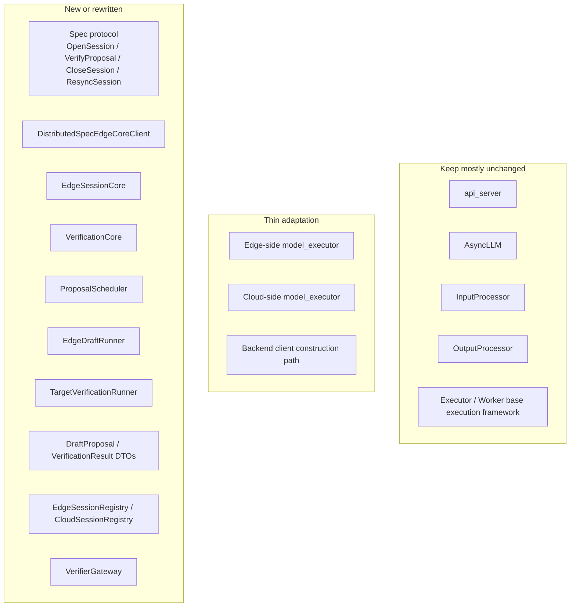

# Distributed Draft-Model Speculative Decoding on vLLM

## 1. Purpose

This document is a standalone implementation handoff for a third-party engineer or AI agent.

The reader should assume no prior context beyond what is written here.

The goal is to implement a **distributed speculative decoding framework** on top of the existing vLLM codebase, with the following model split:

- the **draft model** runs on an **edge node**
- the **target model** runs on a **cloud node**
- the edge node proposes draft tokens
- the cloud node verifies them

This document is not intended to fully specify every source-level detail. It defines:

- what the system should do
- what parts of vLLM should be reused
- what parts should be replaced or extended
- how one end-to-end request should run
- a recommended implementation order

---

## 2. Scope

## 2.1 In scope

- text generation only
- `draft_model` speculative decoding only
- cloud-edge split execution
- edge-side draft generation
- cloud-side target verification
- dynamic binding from an edge node to a cloud verifier node
- support for multiple sessions over time

## 2.2 Out of scope for the first implementation

- EAGLE
- MTP
- multimodal models
- production-grade failover
- migration of active KV state between verifier nodes
- autoscaling and service discovery infrastructure
- full optimization of batch policy

---

## 3. Target design

The target design is **not** “rewrite vLLM into two unrelated services”.

The preferred design is:

- keep the **vLLM frontend** as intact as possible
- keep the **worker/executor orchestration** where possible
- insert the distributed speculative logic **below the frontend**, primarily around:
  - core client
  - session coordination
  - protocol objects
  - model runners

The intended architecture is:

- edge side:
  - reuse `api_server`
  - reuse `AsyncLLM`
  - keep compatibility with the offline `LLM` / `LLMEngine` path when practical,
    so the same distributed backend can serve both online and offline callers
  - replace the local engine core path with a distributed speculative backend client
  - run the draft model locally
- cloud side:
  - do **not** expose the OpenAI-compatible server as the main entrypoint
  - expose an internal verifier service
  - run the target model in a verifier-oriented execution core

---

## 4. High-level architecture

---

## 5. Core design constraints

The implementation should follow these constraints.

## 5.1 Keep the vLLM frontend intact

Prefer to keep these components unchanged or minimally changed:

- `vllm/entrypoints/openai/api_server.py`
- `vllm/v1/engine/async_llm.py`
- `vllm/v1/engine/output_processor.py`
- the request streaming flow already used by `AsyncLLM`

Reason:

- the OpenAI-compatible frontend already works well
- tokenization, streaming, detokenization, request output aggregation, and abort handling are already implemented

## 5.2 Do not force the existing single-node speculative loop into a distributed shape

In current vLLM, speculative decoding for `draft_model` is effectively a local loop inside the worker/model runner path.

That local loop should **not** be extended directly across the network. It should be **split** into:

- edge-side draft proposal
- cloud-side verification

## 5.3 Edge is the source of truth for accepted prefix

The edge node should own the logical session state:

- `accepted_prefix`
- `session_version`
- current verifier binding

Reason:

- the user connects to the edge node
- the edge node continues draft generation
- if the verifier changes later, the edge node should be able to reconstruct cloud-side state

## 5.4 Cloud should be a verifier service, not a user-facing text generation server

The cloud node should expose verifier RPCs, not the OpenAI completion endpoint as its main interface.

## 5.5 The first implementation should prioritize a correct control path over full optimization

The first milestone should focus on:

- a correct end-to-end session flow
- correct accepted-prefix behavior
- correct structured outputs

Implementation update:

- for distributed draft-model speculative decoding, structured outputs are
  compiled independently on edge and verifier via a lightweight local factory
  that reuses the existing V1 backend implementations
- this avoids depending on the V1 scheduler-side `StructuredOutputManager`,
  which is tied to the native engine path and is not directly reusable by the
  separate verifier service

It should not initially optimize:

- verifier batch scheduling quality
- session migration
- high-scale routing

---

## 6. Existing vLLM areas to reuse

The implementation should deliberately reuse existing vLLM abstractions where they match the new design.

## 6.1 Frontend and request/output flow

Reuse:

- `api_server`
- `AsyncLLM`
- `InputProcessor`
- `OutputProcessor`
- `RequestOutputCollector`

Desired outcome:

- the user still interacts with the edge service using the standard vLLM frontend path
- confirmed tokens still flow back through existing output processing

## 6.2 Execution framework

Reuse where practical:

- `vllm/v1/executor/abstract.py`
- existing executor orchestration
- `vllm/v1/worker/gpu_worker.py`

The executor/worker layers already provide:

- model initialization
- warmup
- worker process orchestration
- device-parallel plumbing

These are high-value pieces and should not be rewritten unless necessary.

## 6.3 Core client abstraction style

Prefer to extend the style of:

- `vllm/v1/engine/core_client.py`

Reason:

- vLLM already separates frontend from backend through a client abstraction
- the distributed speculative backend should be introduced at a similar boundary
- in practice this boundary has both async (`AsyncLLM`) and sync (`LLMEngine`)
  consumers, so the distributed client should ideally support both

---

## 7. Existing vLLM areas that should not be reused directly

## 7.1 The current single-node speculative decode control loop

Do not directly reuse the current single-node loop in `GPUModelRunner` as-is.

Reason:

- it couples target sampling and local draft proposal generation inside one process-local hot path
- that structure does not map cleanly to edge/cloud separation

## 7.2 The current `DraftTokenIds` object

Do not use the current draft return object as the distributed protocol object.

Reason:

- it only carries token ids
- the distributed design needs proposal metadata and probabilities

## 7.3 The current local rejection path as the final external interface

The local speculative path currently produces final sampled tokens inside the single-node flow.

That is not sufficient for the distributed design, which needs an explicit, structured verifier response.

---

## 8. Required new components

The following new components are expected.

## 8.1 Edge side

### `DistributedSpecEdgeCoreClient`

Role:

- backend client used by `AsyncLLM`
- replaces the role of the local `EngineCoreClient` for this mode

Responsibilities:

- accept new requests from the frontend
- create and manage edge sessions
- drive the draft runtime
- communicate with the cloud verifier
- return outputs back in a form consumable by the existing output pipeline

### `EdgeSessionCore`

Role:

- the session coordinator on the edge node

Responsibilities:

- create local session state
- open and close remote verifier sessions
- trigger draft prefill and draft proposal generation
- send proposals to the verifier
- receive verification results
- update logical accepted prefix
- produce confirmed output tokens for the frontend

### `EdgeSessionRegistry`

Role:

- state store for active edge sessions

Suggested per-session fields:

- `session_id`
- `accepted_prefix`
- `session_version`
- draft-side runtime state
- verifier binding information
- sampling params

### `EdgeDraftRunner`

Role:

- draft-model runtime

Responsibilities:

- prompt prefill
- propose draft tokens
- provide draft probabilities
- apply verification results
- update draft-side internal state

## 8.2 Cloud side

### `VerifierGateway`

Role:

- internal service endpoint on the cloud node

Responsibilities:

- receive verifier RPCs from edge nodes
- forward them into `VerificationCore`

Expected RPC surface:

- `OpenSession`
- `VerifyProposal`
- `CloseSession`
- `ResyncSession`

### `VerificationCore`

Role:

- main target-side verification control loop

Responsibilities:

- create and close target sessions
- enqueue incoming proposals
- invoke the proposal scheduler
- drive target execution through executor/worker/runner
- return structured verification results

### `ProposalScheduler`

Role:

- verifier-side scheduler

Responsibilities:

- batch proposal verification work across sessions
- manage verifier token budget
- coordinate proposal fairness and timeouts
- drive target-side verification batches
- aggregate short micro-batches even before a fully tensorized target runner
  exists; a batch-oriented scheduler API with sequential fallback is acceptable
  as an intermediate step

### `CloudSessionRegistry`

Role:

- state store for target-side verifier sessions

Suggested per-session fields:

- `session_id`
- current synced prefix length
- target-side runtime state / KV state
- active proposal bookkeeping
- lease or timeout metadata

### `TargetVerificationRunner`

Role:

- target-model runtime specialized for verification

Responsibilities:

- prompt prefill
- verifier-side target forward passes
- generation of structured verification results
- update target-side runtime state

---

## 9. Required protocol objects

The distributed design requires explicit protocol objects. The implementation should define them as structured data types, not ad hoc dict payloads.

## 9.1 `OpenSessionRequest`

Minimum expected fields:

- `session_id`
- `prompt_token_ids`
- model/sampling metadata needed by the verifier
- initial version, if used

## 9.2 `DraftProposal`

Minimum expected fields:

- `session_id`
- `proposal_id`
- `base_version`
- `accepted_prefix_len`
- `draft_token_ids`
- `draft_token_probs`

Optional future fields:

- top-k draft distributions
- per-token metadata

## 9.3 `VerificationResult`

Minimum expected fields:

- `session_id`
- `proposal_id`
- `base_version`
- `accepted_len`
- `accepted_token_ids`
- `bonus_token_id`
- `reject_pos`
- `target_probs_at_reject_pos`
- verifier-side post-commit version

## 9.4 `CloseSessionRequest`

Minimum expected fields:

- `session_id`

## 9.5 `ResyncSessionRequest`

Minimum expected fields:

- `session_id`
- accepted prefix tokens or equivalent state
- edge-side version

---

## 10. End-to-end request flow

This section describes the intended control path for a single request.

## 10.1 Startup

### Cloud startup

The cloud node:

- loads the target model
- initializes the executor/worker/runner path
- initializes verifier-side session state management
- starts the verifier service endpoint

### Edge startup

The edge node:

- loads the draft model
- initializes local draft executor/worker/runner components
- starts the standard vLLM frontend
- uses the distributed speculative backend client instead of the default local core path

## 10.2 Request flow

## 10.3 Detailed behavior

### Step 1: request enters the edge frontend

The request should enter through the existing frontend path.

Expected behavior:

- prompt is processed normally
- sampling params are processed normally
- the request is registered with the edge-side backend client

### Step 2: edge creates a local session

The edge side should create session-local state, including:

- request id / session id
- accepted prefix initialized to the prompt
- version initialized appropriately
- draft runtime state

### Step 3: edge opens a verifier session on the cloud

The edge side should call `OpenSession`.

The cloud side should:

- create a target-side session
- perform prompt prefill
- initialize target-side runtime/KV state

### Step 4: edge generates a draft proposal

The edge draft runner should:

- perform draft prefill if not already done
- propose `K` draft tokens
- provide probabilities needed by the verifier and recovery logic

### Step 5: cloud verifies the proposal

The cloud side should:

- enqueue the proposal
- batch it with other verifier work if applicable
- run target forward verification
- return a structured `VerificationResult`

The result should support at least two cases:

- all proposed tokens accepted, plus bonus token
- partial acceptance with a reject position and recovery distribution

### Step 6: edge commits only confirmed output

The edge side should update the accepted prefix using the verification result.

Important rule:

- **only confirmed tokens may be emitted to the user**

That means draft tokens must never be streamed directly before verification.

### Step 7: repeat

The edge side should continue the loop:

- draft
- verify
- commit
- stream confirmed output

### Step 8: close the session

When generation stops:

- edge closes the remote verifier session
- cloud releases target-side state
- edge releases local state

---

## 11. Preferred implementation strategy

The implementation should be phased.

## 11.1 Phase 1: minimum viable control path

Objective:

- one edge node
- one cloud node
- one request at a time
- no batch optimization
- no failover

Deliverables:

- `VerifierGateway`
- `EdgeSessionCore`
- `EdgeDraftRunner`
- `TargetVerificationRunner`
- `DraftProposal`
- `VerificationResult`

This phase should prove:

- the protocol is correct
- the control loop is correct
- only verified output reaches the user

## 11.2 Phase 2: integrate the existing frontend cleanly

Objective:

- preserve `api_server + AsyncLLM + OutputProcessor`
- make the new backend fit the existing frontend interface

Deliverables:

- `DistributedSpecEdgeCoreClient`
- frontend wiring changes only where necessary

## 11.3 Phase 3: cloud-side batching

Objective:

- support multiple sessions efficiently

Deliverables:

- `ProposalScheduler`
- verifier-side batching policy
- session queueing and fairness

Implementation note:

- if the first cloud runner implementation cannot yet do true tensorized
  verification across sessions, the scheduler should still expose a
  batch-oriented interface and micro-batch ready proposals, so the runner can be
  upgraded later without changing the edge/cloud protocol surface

## 11.4 Phase 4: resilience and routing improvements

Possible later work:

- verifier selection
- session resync
- verifier switching
- timeout recovery

---

## 12. Acceptance criteria for the first milestone

The first milestone is complete when all of the following are true:

- an edge service can receive a standard generation request
- the edge service can open a verifier session on a cloud node
- the edge draft runner can generate proposals
- the cloud target runner can verify those proposals
- the edge side updates accepted prefix correctly
- only confirmed tokens are streamed back to the user
- the session closes cleanly on both sides

Nice-to-have but not required for the first milestone:

- proposal batching
- verifier selection logic
- session migration

---

## 13. Known open design points

The following points are intentionally left open for implementation-time analysis.

They should not block the first milestone.

- exact RPC transport choice between edge and cloud
- exact shape of probability payloads in `DraftProposal`
- whether rejection recovery returns only one-step target probabilities or richer metadata
- whether the first milestone should do conservative recovery only
- exact verifier-side batching policy

Recommended default:

- keep the first version conservative and simple
- recover one token at the reject position
- then continue with the next proposal round

---

## 14. Suggested source files to inspect first

The implementer should inspect these files first in the vLLM repo:

- `vllm/entrypoints/openai/api_server.py`
- `vllm/engine/protocol.py`
- `vllm/v1/engine/async_llm.py`
- `vllm/v1/engine/core_client.py`
- `vllm/v1/engine/core.py`
- `vllm/v1/engine/output_processor.py`
- `vllm/v1/executor/abstract.py`
- `vllm/v1/worker/gpu_worker.py`
- `vllm/v1/worker/gpu_model_runner.py`
- `vllm/v1/outputs.py`
- `vllm/v1/sample/rejection_sampler.py`

These files cover:

- the current frontend/backend boundary
- the current request and output flow
- the current executor/worker/runner structure
- the current local speculative decoding path

---

## 15. Implementation guidance summary

The implementation should follow this summary:

1. Preserve the frontend.
2. Introduce the distributed speculative design below the frontend boundary.
3. Make edge own the logical session state.
4. Make cloud own verifier execution state.
5. Introduce explicit protocol objects instead of reusing local-only draft token outputs.
6. Split the current single-node speculative loop into:
   - edge-side proposal generation
   - cloud-side target verification
7. Optimize later; first make the control path correct.

---

## 16. Module categorization

---

## 17. Final note

This document is a guidance document, not a source-of-truth replacement for the codebase.

If an implementation detail in this document conflicts with the actual responsibility boundaries in the vLLM source tree, the codebase should be treated as authoritative, and the design should be adjusted accordingly while preserving the architecture intent described above.
